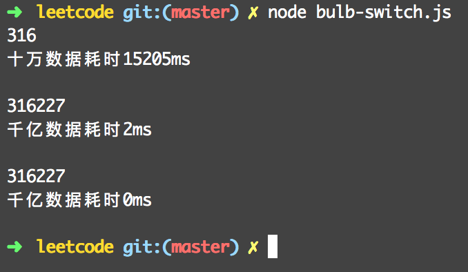

## Bulb Switcher（很有意思的一道题）

### Question:

There are n bulbs that are initially off. You first turn on all the bulbs. Then, you turn off every second bulb.     
On the third round, you toggle every third bulb (turning on if it's off or turning off if it's on).       
For the ith round, you toggle every i bulb. For the nth round, you only toggle the last bulb.       
Find how many bulbs are on after n rounds.     

### Example:

Given n = 3. 

At first, the three bulbs are [off, off, off].    
After first round, the three bulbs are [on, on, on].     
After second round, the three bulbs are [on, off, on].       
After third round, the three bulbs are [on, off, off].        

So you should return 1, because there is only one bulb is on.

### Answer1: O(n*n)

```js
let bulbSwitch = function(n) {
  let factorNum = function(m) {
    let num = 0;
    for (let i = 1; i <= m / 2 ; i++) {
      if (m % i === 0) {
        num ++;
      }
    }
    num++;
    return num;
  }
  let isBulbOn = 0;
  for (let i = 1; i <= n; i++) {
    if (factorNum(i) % 2 !== 0) {
      isBulbOn++;
    }
  }
  return isBulbOn;
}
let now1 = new Date().getTime();
console.log(bulbSwitch(100000));
let time1 = new Date().getTime() - now1;
console.log('十万数据耗时' + time1 + 'ms\n');
```

### Answer2: O(n)

```js
let bulbSwitch2 = function(n) {
  for (let i = 0; i <= n; i++) {
    if (n <= (i + 1) * (i + 1) -1) {
      return i;
    }
  }
}
let now2 = new Date().getTime();
console.log(bulbSwitch2(100000000000));
let time2 = new Date().getTime() - now2;
console.log('千亿数据耗时' + time2 + 'ms\n');
```

### Answer3: O(1)

```js
let bulbSwitch3 = function(n) {
  return Math.floor(Math.sqrt(n));
 }
let now3 = new Date().getTime();
console.log(bulbSwitch3(100000000000));
let time3 = new Date().getTime() - now3;
console.log('千亿数据耗时' + time3 + 'ms\n');
```

### Result:



### Explain:

只有灯泡被开关奇数次才是点亮的。
我们把n个灯泡称为灯泡1...灯泡n。在第d轮，如果i可以整除d，那么灯泡i会开关一次。因此如果i有奇数个除数，那么灯泡i是点亮的。   
除数总是成双出现的，比如i=12，有除数1和12，2和6，3和4。除非i是个平方数，比如36，有除数1和36，2和18.3和12，4和9以及两个6。因此，如果灯泡i是个平方数，那么灯泡i最终是点亮的。     

因此，我们只需要计算1到n之间平方数的个数即可。n的平方根向下取整即1到n之间平方数的个数。

### Link

https://leetcode.com/problems/bulb-switcher/